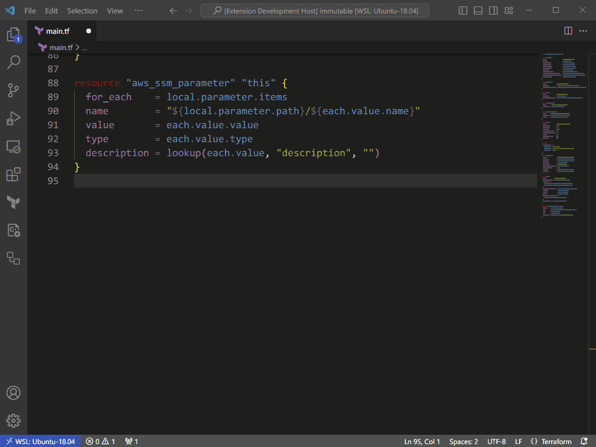

# terraform-provider-docs-opener-vscode-extension

Yes. It is just an extension that opens the terraform document page in the browser that you're highlighting, that's all.



## Settings

You can change some parameters in your settings.json.

```json
    "tfpd_opener.fqdn": "registry.terraform.io",
    "tfpd_opener.paths": {
        "aws": "providers/hashicorp/aws/latest/docs/resources",
        "google": "providers/hashicorp/google/latest/docs/resources",
        // "foo_provider": "path/to/foo"
    },
```

## Future Works

- Not only `resource` but `data`
